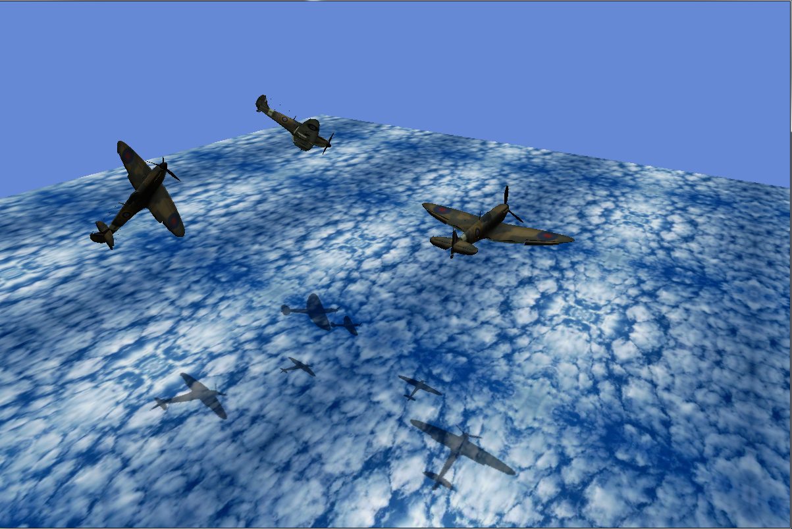

# OpenGL-Light-Caster-Project

## About The Project
This project consists on the implementation of one or more light caster in order to generate shadow below the models and rendered objects. 
 
To accomplish this goal, modern OpenGL version 4.4 was used, in addition to the libraries: 
GLM. 
ASSIMP.  
GLEW.  
GLFW.  
ImageMagick.  
 
Also, GLSL was used to perform the calculations of the vertices and fragments in  the video card (GPU), in order to relieve the processor (CPU) from complex calculation and stress. 
In addition, the models or the light casters should be able to move in the scene to create a dynamic effect of the shadow on the floor and other objects. 
 

## Results

## Acknowledgments
You can find further information here: https://sites.google.com/view/pablovela/software/opengl
